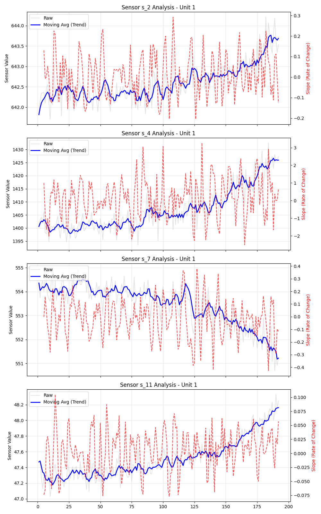

# ✈️ NASA CMAPSS Predictive Maintenance ETL


-orange)

## 📖 Executive Summary
This project implements a **High-Performance ETL Pipeline** for Predictive Maintenance (PdM) using the NASA CMAPSS Turbofan Jet Engine dataset (FD001).

Unlike standard implementations that rely on slow iterative loops, this pipeline utilizes **Vectorized Numerical Operations** (via `numpy.lib.stride_tricks`) to calculate degradation trends in O(1) time complexity. It is designed with **Clean Code principles**, strictly typed, and physically validated against the degradation models described in Saxena et al. (2008).

## 🚀 Key Technical Features

- **⚡ Vectorized Slope Calculation:** Implemented a custom Linear Regression using sliding window matrices. This avoids Python loops entirely for feature engineering, offering massive speedups over `pandas.Rolling.apply`.
- **🏗️ Automated Ingestion:** Self-healing pipeline that detects missing data and automatically fetches it using the `kagglehub` API.
- **🛡️ Robust Architecture:** - **Type Hinting** & **Docstrings** (Google Style) for all modules.
  - **Modular Design:** Separation of concerns (Ingestion -> Numerical Ops -> Feature Eng -> Visualization).
  - **Pathlib** implementation for full Linux/Windows compatibility.
- **📊 Automated Reporting:** Generates visual degradation reports for key sensors to validate physical consistency.

## 📉 Physics & Math Validation

The pipeline has been audited against the reference paper *"Damage Propagation Modeling for Aircraft Engine Run-to-Failure Simulation"*.

### 1. Exponential Degradation
The algorithm correctly captures the **exponential nature** of the fault described in the paper. As seen in the generated reports, the **Slope (Degradation Rate)** increases drastically as the engine approaches the end of its life (RUL = 0).

### 2. Sensor Correlation
The processed data reflects accurate thermodynamic responses to HPC (High-Pressure Compressor) degradation:
* **Sensor 4 (Low-Pressure Turbine Temperature):** Increases significantly (+30°K) due to efficiency loss.
* **Sensor 7 (Total Pressure):** Decreases, indicating compression loss.

### Visual Report Example (Unit 1)

*(Generated automatically by `src/visualization.py`)*

## 📂 Project Structure

```text
NASA_Predictive_Maint/
├── config/             # Global settings and constants
├── data/               # Data storage (gitignored)
│   ├── raw/            # Auto-downloaded CMAPSS data
│   └── processed/      # ETL Output (CSV)
├── reports/            # Generated visual reports
│   └── figures/        # PNG plots of sensor trends
├── src/                # Source Code
│   ├── data_loader.py  # KaggleHub integration & Ingestion
│   ├── numerical_ops.py# Vectorized Math (Sliding Window View)
│   ├── feature_eng.py  # RUL Target Calculation
│   └── visualization.py# Matplotlib reporting engine
├── main.py             # Pipeline Orchestrator
└── requirements.txt    # Production dependencies
```

## 🛠️ Setup & Usage
Prerequisites
* Python 3.9+
* Git

Installation


```
# 1. Clone the repository
git clone git@github.com:GONZALEZL0310/NASA_Predictive_Maint.git
cd NASA_Predictive_Maint

# 2. Install dependencies
pip install -r requirements.txt
```
Running the Pipeline

No manual download required. The script will handle data fetching.
```
python main.py
```
Output: 1. Downloads train_FD001.txt to data/raw/. 2. Processes signals and calculates vector slopes. 3. Saves processed dataset to data/processed/. 4. Generates inspection plots in reports/figures/.

📚 References
```text
Dataset: NASA CMAPSS Jet Engine Simulated Data

Reference Paper: Saxena, A., Goebel, K., Simon, D., & Eklund, N. (2008). 
Damage Propagation Modeling for Aircraft Engine Run-to-Failure Simulation. 
International Conference on Prognostics and Health Management.
```


Developed by Luciano Martin Gonzalez - 2025